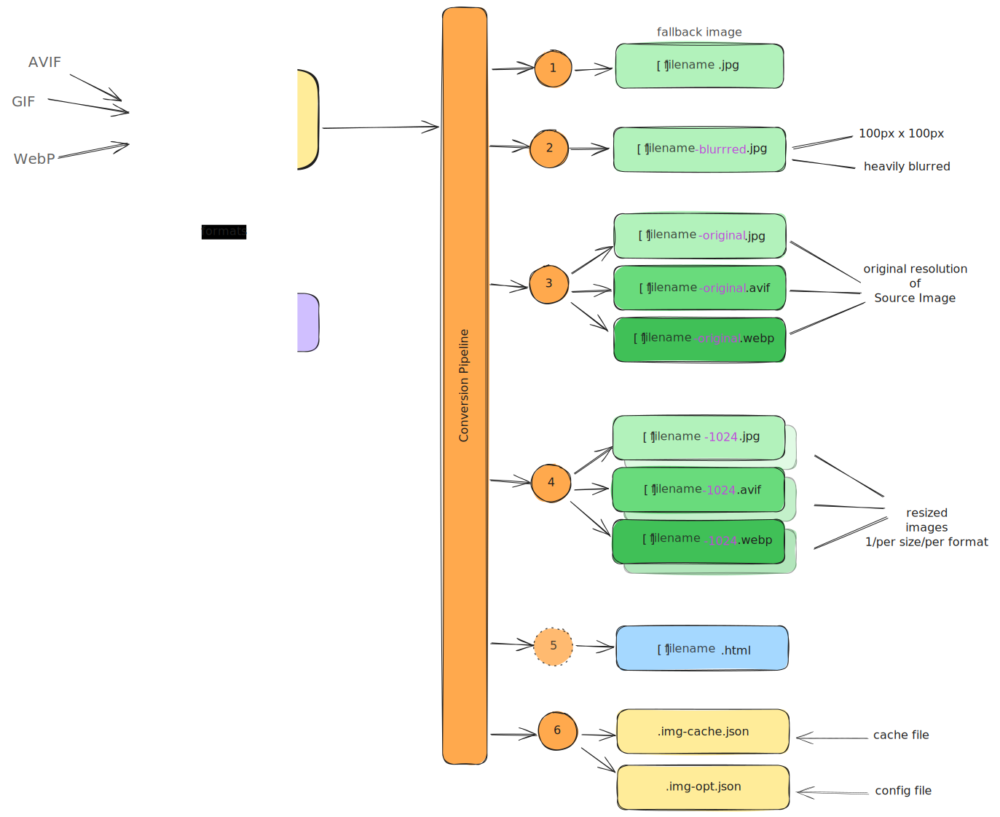

# Image Opt

> A CLI and Vite plugin which converts image assets into a highly optimized set of images for use on the web.

## Installation

```sh
# install globally
pnpm install -g @yankeeinlondon/image-opt

# install locally to repo
pnpm install -D @yankeeinlondon/image-opt
```

## Source to Destination Mapping

Rather than just perform a `1:1` mapping with some compression or possibly image format conversion, we instead convert a source image into _many_ images with the expectation that the user will want to leverage modern techniques to allow the runtime environment to choose the best asset for a given client.




## CLI Usage

### Overview

```sh
# help menu
io --help

# interactive configuration
io -i

# convert a single file (no config needed)
io public/foobar.jpg --to dist
# single file with explicit sizes
io public/foobar.jpg --to dist --sizes=1024,640,320

# convert using configuration
io
# break any cached conversions
io -f

# watch mode
io --watch
# or
io -w
```

### Modes

There are two primary _modes_ of operation for the `io` CLI:

1. One Off
2. Configure and Repeat

The second use-case is really the primary goal for this repo but you can see above in the CLI overview that _one-off_ conversions are also an option should you need them.

### Configure and Repeat

You can either configure file yourself (which should reside at `.img-opt.json` in the root of your repo), or run `io -i` to configure it interactively. For most people we'd just recommend the interactive option to start but once you see the configuration file it's sometimes easier to make any future modifications directly on the configuration file.

#### Configuration Structure

Here's a rough approximation of the configuration structure your JSON file will take on but refer to the `ConfigFile` type in the repo for an
always up-to-date articulation of this.

```ts
type InputFormat = "jpg" | "png" | "webp" | "avif" | "gif" | "tiff";
type OutputFormat = "jpg" | "png" | "webp" | "avif" | "gif" | "heif";

type SourceConfig = {
	/** a glob pattern used to identify which files are part of this set of images */
	glob: string;
	/** the sizes these images will be resized to (in addition to retaining full resolution) */
	sizes?: number[];
	formats?: OutputFormat[];
	/** whether metadata should be preserved or stripped */
	withMetadata?: boolean;
	/** the directory to output these files into */
	outputDir?: string;
	quality?: {
		jpg?: { ... };
		webp?: { ... };
		avif?: { ... };
		gif?: { ... };
		heif?: { ... };
	}
}

type ConfigFile = {
	// default values
	defaultSizes: number[];
	defaultFormats: InputFormat[];
	defaultMeta: boolean;
	defaultOutputDir: string;
	qualityDefaults: {
		jpg: { ... };
		webp: { ... };
		avif: { ... };
		gif: { ... };
		heif: { ... };
	}
	// configuration per set of source images
	sources: SourceConfig[];
}
```

Reviewing the structure you can see that:

- the _default_ properties are likely to be highly reusable across different source groups
  - the defaults we provide when using the interactive configuration may be all you ever need/use
- each _source group_ defines a `glob` pattern to identify which files it bring in; all other properties are optional

### Caching

Because each source image will be converted to several destination images there is value in making sure we only convert source images which have changed. Therefore, by default, when you run `io` it will use a cache file located at `.img-cache.json` to ensure that only the _required_ work is done to reach the end state. Should you ever want to break the cache then just add the `--force` or `-f` flag to the CLI and it will will blow away the existing cache, convert everything and rebuild a cache from this work.

The cache mechanics are rather simple, it simply looks at the file's last modified date and file size and if they've changed it assume the image has changed. That means if you `touch` a file you want to be sure to be [re-]converted then that should work.

## Vite Plugin

This will eventually be made into a [Vite](https://vitejs.dev) plugin but currently just stabilizing the CLI use cases.
